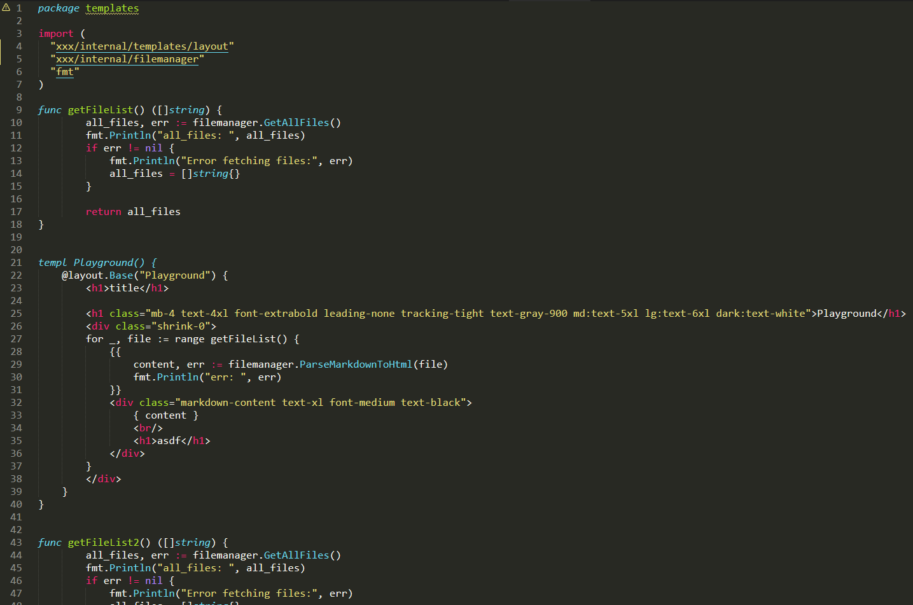

# Syntax Highlighting for templ Files

This is my best attempt to create a syntax highlighting Plugin for [go Templ](https://templ.guide/).

## Screenshot

With color scheme Monokai

# Installation

## Package Manager

- Install [Package Control](https://packagecontrol.io/installation)
- Use [Package Control](https://packagecontrol.io/docs/usage) to search for Templ and install the package

## Manual

Clone the repository in your Sublime Text "Packages" directory:

`git clone https://github.com/papierkorp/sublime-templ.git Templ`
